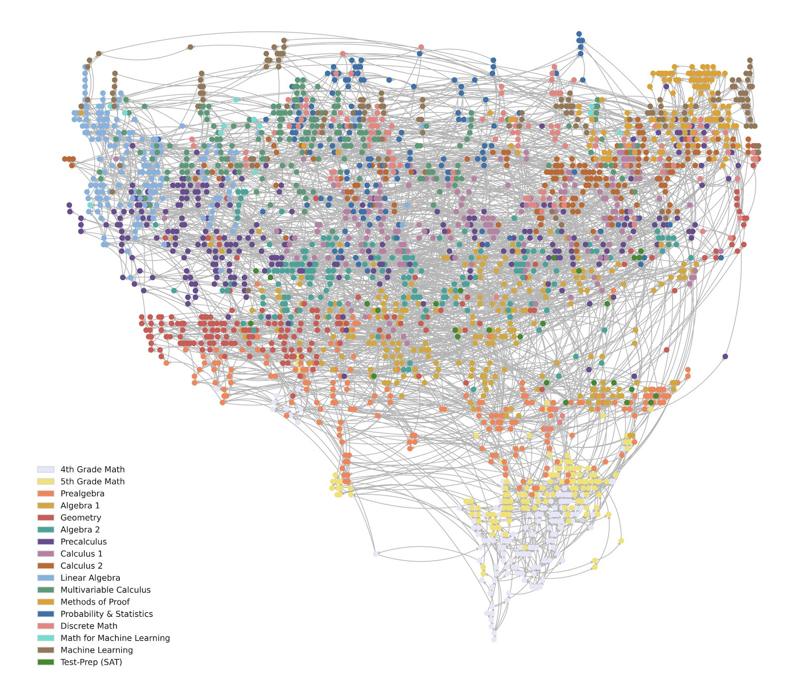

Hi, I'm Alex Smith, a mathematician based in Kent, England. I’m the Chief Content Architect at <a href="http://www.mathacademy.com/">Math Academy</a>, where my colleagues and I have built what may be the world's largest online mathematics curriculum. I joined Math Academy in its infancy in 2017 as a tutorial writer, and this quickly expanded into leading the entire content development process, supported by a team of highly qualified mathematicians, most of whom hold Ph.D.s, contributing to a substantial and continually expanding body of material.

The clearest expression of this work is a <strong>knowledge graph</strong> I designed covering more than 3,000 mathematics topics, spanning the full pathway from 4th-grade mathematics to university-level material.

The knowledge graph is not just a way of organizing content. It reflects the dependency structure of mathematics itself: what ideas rest on which foundations, what readiness actually means, and why sequencing matters.

My academic background is in applied mathematics, and I hold a Ph.D. in Mathematics from University College London. Although my formal training is in applied math, I have always been drawn to pure mathematics as well.

Over the years, I’ve taught mathematics to hundreds of students, especially at A-level and undergraduate level. That experience has shaped how I think about mathematical development: strong performance is rarely a mystery. More often, it is the result of well-ordered knowledge, secure foundations, and careful communication.

My work sits at the intersection of mathematics, curriculum design, and system design. I’m interested not only in explaining difficult ideas clearly, but also in building functioning systems — involving both people and technology — that make serious and high-quality work possible at scale.

## Media

* I'm fairly active on X (formerly Twitter). You can follow me <a href="https://x.com/ninja_maths">here</a>.

* I sometimes participate in the <a href="https://www.youtube.com/@math-academy-online">Math Academy Podcast</a> with my colleagues Jason Roberts, Founder of Math Academy, and Justin Skycak, our Chief Quant. You can find the podcast on YouTube <a href="https://www.youtube.com/@math-academy-online">here</a>.

* Justin and I recently took part in the Chalk & Talk podcast, hosted by Anna Stokke. Link to episode <a href="https://chalkandtalkpodcast.podbean.com/e/math-academy-optimizing-student-learning-with-alex-smith-and-justin-skycak-ep-42/">here</a>.